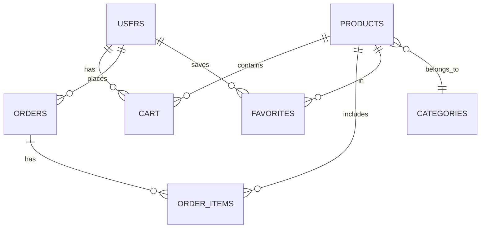

# DL Fashion API - Серверная часть интернет-магазина

REST API для интернет-магазина одежды на Spring Boot с PostgreSQL. Серверная часть учебного проекта, обеспечивающая синхронизацию данных с мобильным приложением Android.

**Связанные репозитории:**
- [Android приложение (клиентская часть)](https://github.com/artem05kz/online_clothing_store).

## Содержание
- [Возможности](#возможности)
- [Архитектура](#архитектура)
- [Технологический стек](#технологический-стек)
- [Схема БД](#схема-бд)
- [API Endpoints](#api-endpoints)
- [Установка и запуск](#установка-и-запуск)
- [Конфигурация](#конфигурация)

## Возможности

- Регистрация и управление пользователями
- CRUD операции для товаров и категорий
- Управление корзиной и заказами
- Система избранного
- Управление промокодами и акциями
- Синхронизация данных с Android приложением
- Хранение данных в PostgreSQL
- CORS поддержка для кросс-доменных запросов

## Архитектура

Приложение следует классической трехслойной архитектуре Spring Boot:
```
┌─────────────────────────────────┐
│   REST Controllers              │  ← HTTP/JSON
├─────────────────────────────────┤
│   JPA Repositories              │  ← Data Access
├─────────────────────────────────┤
│   PostgreSQL Database           │  ← Persistence
└─────────────────────────────────┘
```

### Основные компоненты

**Controller Layer:**
- `UserController` - управление пользователями
- `ProductController` - управление товарами
- `CartController` - корзина
- `OrderController` - заказы
- `FavoriteController` - избранное
- `PromoController` - промокоды
- `CategoryController` - категории

**Model Layer:**
- JPA Entity классы с Lombok аннотациями
- Связи между таблицами (OneToMany, ManyToOne)
- Cascade операции для целостности данных

**Repository Layer:**
- Spring Data JPA репозитории
- Кастомные запросы с @Query
- Автоматическая генерация методов

## Технологический стек

- **Framework:** Spring Boot 3.5.0
- **Язык:** Java 21
- **БД:** PostgreSQL 42.7.5
- **ORM:** Hibernate (JPA)
- **Сериализация:** Jackson
- **Документация:** Lombok
- **Сборка:** Maven

### Основные зависимости
```xml
<dependencies>
    <!-- Spring Boot -->
    <dependency>
        <groupId>org.springframework.boot</groupId>
        <artifactId>spring-boot-starter-web</artifactId>
    </dependency>
    
    <!-- Data JPA -->
    <dependency>
        <groupId>org.springframework.boot</groupId>
        <artifactId>spring-boot-starter-data-jpa</artifactId>
    </dependency>
    
    <!-- PostgreSQL -->
    <dependency>
        <groupId>org.postgresql</groupId>
        <artifactId>postgresql</artifactId>
    </dependency>
    
    <!-- Lombok -->
    <dependency>
        <groupId>org.projectlombok</groupId>
        <artifactId>lombok</artifactId>
    </dependency>
</dependencies>
```

## Схема БД

### Основные таблицы
```sql
users (
    id SERIAL PRIMARY KEY,
    name VARCHAR NOT NULL,
    email VARCHAR UNIQUE NOT NULL,
    password_hash VARCHAR NOT NULL,
    address VARCHAR
)

products (
    id SERIAL PRIMARY KEY,
    name VARCHAR NOT NULL,
    price DECIMAL NOT NULL,
    description TEXT,
    size VARCHAR,
    brand VARCHAR,
    rating DECIMAL,
    main_image_url VARCHAR,
    composition TEXT,
    category_id INTEGER → categories(id)
)

categories (
    id SERIAL PRIMARY KEY,
    name VARCHAR NOT NULL
)

cart (
    id SERIAL PRIMARY KEY,
    user_id INTEGER → users(id) ON DELETE CASCADE,
    product_id INTEGER → products(id) ON DELETE CASCADE,
    quantity INTEGER NOT NULL
)

orders (
    id SERIAL PRIMARY KEY,
    user_id INTEGER → users(id) ON DELETE CASCADE,
    order_date TIMESTAMP,
    status VARCHAR,
    address VARCHAR
)

favorites (
    user_id INTEGER → users(id) ON DELETE CASCADE,
    product_id INTEGER → products(id) ON DELETE CASCADE,
    PRIMARY KEY (user_id, product_id)
)

promos (
    id SERIAL PRIMARY KEY,
    image_url VARCHAR,
    code VARCHAR,
    discount_percent INTEGER,
    description TEXT,
    is_active BOOLEAN
)
```

### ER-диаграмма


## API Endpoints

Базовый URL: `http://localhost:8080/api`

### Users
```http
GET    /api/users                    # Получить всех пользователей
POST   /api/users/register           # Регистрация нового пользователя
POST   /api/users/sync               # Синхронизация пользователей
PUT    /api/users/{id}               # Обновить данные пользователя
```

**Пример регистрации:**
```json
POST /api/users/register
{
    "name": "John Doe",
    "email": "john@example.com",
    "passwordHash": "$2a$10$..."
}
```

### Products
```http
GET    /api/products                 # Получить все товары
GET    /api/products/with-categories # Товары с категориями (eager loading)
POST   /api/products/sync            # Синхронизация товаров
```

**Ответ:**
```json
[
    {
        "id": 1,
        "name": "Футболка NIKE",
        "price": 1999.0,
        "description": "Классическая футболка",
        "size": "M",
        "brand": "NIKE",
        "rating": 4.7,
        "mainImageUrl": "https://...",
        "composition": "100% хлопок",
        "categoryId": 2
    }
]
```

### Cart
```http
GET    /api/cart?user_id={userId}    # Получить корзину пользователя
POST   /api/cart/sync                # Синхронизация корзины
```

### Orders
```http
GET    /api/orders                   # Все заказы
GET    /api/orders?user_id={userId}  # Заказы пользователя
POST   /api/orders/sync              # Синхронизация заказов
```

### Favorites
```http
GET    /api/favorites?user_id={id}   # Избранное пользователя
POST   /api/favorites/sync           # Синхронизация избранного
```

### Promos
```http
GET    /api/promos                   # Все промокоды
GET    /api/promos/active            # Активные промокоды
GET    /api/promos/{code}            # Промокод по коду
POST   /api/promos/sync              # Синхронизация промокодов
```

### Categories
```http
GET    /api/categories               # Все категории
POST   /api/categories/sync          # Синхронизация категорий
```

## Установка и запуск

### Предварительные требования

- Java 21+
- Maven 3.9+
- PostgreSQL 12+

### Шаги установки

1. **Клонирование репозитория:**
```bash
git clone https://github.com/your-username/online-clothing-store-server.git
cd online-clothing-store-server
```

2. **Настройка PostgreSQL:**

Создайте базу данных:
```sql
CREATE DATABASE online_clothing_store;
```

3. **Конфигурация приложения:**

Отредактируйте `src/main/resources/application.properties`:
```properties
spring.datasource.url=jdbc:postgresql://localhost:5432/online_clothing_store
spring.datasource.username=YOUR_USERNAME
spring.datasource.password=YOUR_PASSWORD

spring.jpa.hibernate.ddl-auto=update
spring.jpa.show-sql=true
spring.jpa.properties.hibernate.format_sql=true
```

4. **Сборка проекта:**
```bash
./mvnw clean install
```

5. **Запуск приложения:**
```bash
./mvnw spring-boot:run
```

Или с ограничением компиляции для более быстрого старта:
```bash
./mvnw spring-boot:run -Dspring-boot.run.jvmArguments="-XX:TieredStopAtLevel=1"
```

6. **Проверка работоспособности:**

Откройте в браузере: `http://localhost:8080/api/products`

## Конфигурация

### CORS Configuration

CORS настроен для приема запросов от всех источников:
```java
@Configuration
public class WebConfig implements WebMvcConfigurer {
    @Override
    public void addCorsMappings(CorsRegistry registry) {
        registry.addMapping("/api/**")
                .allowedOrigins("*")
                .allowedMethods("GET", "POST", "PUT", "DELETE");
    }
}
```

### JPA Configuration
```properties
# Автоматическое создание/обновление схемы БД
spring.jpa.hibernate.ddl-auto=update

# Логирование SQL запросов
spring.jpa.show-sql=true
spring.jpa.properties.hibernate.format_sql=true
```

### Порт и контекст

По умолчанию приложение запускается на порту `8080`. Для изменения:
```properties
server.port=9000
server.servlet.context-path=/api
```

## Синхронизация данных

API поддерживает синхронизацию данных с Android приложением через endpoint'ы `/sync`:

1. **Android → Server:** Отправка локальных изменений
2. **Server → Android:** Получение актуальных данных

Синхронизация происходит автоматически при:
- Первом запуске приложения
- Входе в систему
- Восстановлении интернет-соединения
- Изменении данных (корзина, избранное, заказы)

## Логирование

Hibernate SQL запросы логируются в консоль для отладки. В production рекомендуется отключить:
```properties
spring.jpa.show-sql=false
```

## Тестирование

Запуск тестов:
```bash
./mvnw test
```

Структура тестов:
```
src/test/java/
└── com/example/online_clothing_store/
    └── OnlineClothingStoreApplicationTests.java
```

## Docker (опционально)

Создайте `Dockerfile`:
```dockerfile
FROM eclipse-temurin:21-jdk-alpine
VOLUME /tmp
COPY target/*.jar app.jar
ENTRYPOINT ["java","-jar","/app.jar"]
```

Сборка и запуск:
```bash
docker build -t dl-fashion-api .
docker run -p 8080:8080 dl-fashion-api
```

## Структура проекта
```
src/main/java/com/example/online_clothing_store/
├── config/
│   └── WebConfig.java              # CORS конфигурация
├── controller/                     # REST контроллеры
│   ├── UserController.java
│   ├── ProductController.java
│   ├── CartController.java
│   ├── OrderController.java
│   ├── FavoriteController.java
│   ├── PromoController.java
│   └── CategoryController.java
├── model/                          # JPA Entity модели
│   ├── User.java
│   ├── Product.java
│   ├── Cart.java
│   ├── Order.java
│   ├── Favorite.java
│   ├── Promo.java
│   └── Category.java
├── repository/                     # Spring Data JPA
│   ├── UserRepository.java
│   ├── ProductRepository.java
│   ├── CartRepository.java
│   ├── OrderRepository.java
│   ├── FavoriteRepository.java
│   ├── PromoRepository.java
│   └── CategoryRepository.java
└── OnlineClothingStoreApplication.java

src/main/resources/
└── application.properties          # Конфигурация Spring Boot
```
## Безопасность
**Важно для production:**

- Включите HTTPS
- Настройте более строгую CORS политику
- Добавьте Spring Security для аутентификации
- Используйте переменные окружения для секретов
- Реализуйте rate limiting
- Добавьте валидацию входных данных

Пример с переменными окружения:
```properties
spring.datasource.username=${DB_USERNAME}
spring.datasource.password=${DB_PASSWORD}
```
